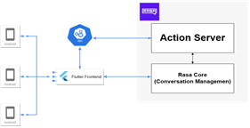

# LCKChat
리그오브레전드 LCK 이스포츠를 좀 더 재밌게 즐길 수 있도록 경기와 관련된 다양한 정보를 제공하기 위해 만들어진 모바일 애플리케이션입니다.

## 개발 기간
23.03.08 ~ 2023.06.26 (약 3개월)

## System Diagram 📌

## Development Environment 🛠
Framework: Flutter 3.10.1 
Language: Dart 3.0.1 
Chatbot: Rasa 3.5.8, Python 3.9.2 (https://github.com/yeseong9769/rasa_lck)

## Functions 📱
- 경기 일정 및 결과 제공
- 경기 통계 제공
- 순위 정보 제공
- 챗봇 기능 제공

## Publications 📚
자연어 처리 기반 챗봇이 포함된 E-스포츠 애플리케이션 개발, 한국컴퓨터정보학회 학술발표논문집, 2023, pp. 501-502. [see here](https://www.dbpia.co.kr/journal/articleDetail?nodeId=NODE11528324)